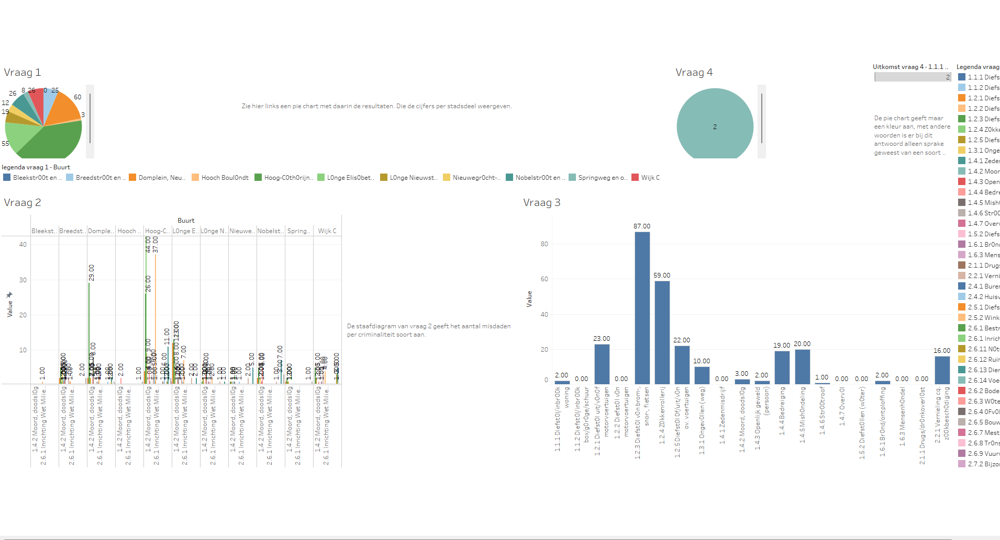

# Data Analist course 1

Via het internet ga jij een data-analyse doen naar de criminaliteit in een bepaalde wijk/gebied van een stad. Bij het verzamelen en verwerken van data kunnen gewenste resultaten verzameld worden om vraagstukken op te lossen. In dit geval kunnen de resultaten die komen uit het rapport, dat **jij** gaat maken, gebruikt worden om de criminaliteit te verminderen met behulp van maatregelen.

Data-analyse is het grondig en zorgvuldig bekijken en interpreteren van gegevens die via een onderzoek zijn verzameld. Uit de data-analyse komen vervolgens resultaten naar voren waarmee je de onderzoeksvragen goed kan beantwoorden

## Search engine

Kopieer en plak de volgende link je browser of doe "ctrl + linkermuisklik" op de link. Vervolgens beantwoord de volgende onderzoeksvragen in een kort rapport: https://www.cbs.nl/nl-nl/visualisaties/politie/dashboard-misdrijven-in-de-buurt/maandcijfers

## **Vraag 1**

Welke 3 buurten/ wijken in Utrecht komen in de top 3 voor m.b.t. geregistreerde criminaliteit?

Als je op de website bent van het cbs zie je het volgende:

We gaan de bepalen in welke drie wijken van Utrecht de meeste criminaliteit wordt geregistreerd. Dat doen wij door 'Utrecht' te selecteren als gemeente uit de lijst of op de kaart.(zie de afbeelding hieronder)

**In de afbeelding is een overzicht te zien van de gemeente Utrecht.**
Onder de kaart van gemeente Utrecht is er nog een kaart dat meer ingezoomd is op de gemeente, er wordt daar echt gekeken per wijk. Scroll naar dat gedeelte van de pagina en vindt de top 3 wijken met de hoogste criminaliteit door of met de muis te bewegen over de verschillende stadsdelen (het aantal criminele activiteiten wordt rechtsboven weergegeven),

of door het tabel van de hele gemeente te bekijken. klik daarvoor op 'Toon tabel' dan krijg je alle resultaten in een tabel vorm:

Als dit allemaal gelukt is ben je nu instaat om data te filteren op gemeente en wijk.

## **Vraag 2**

Wat voor soort criminaliteit wordt het meest gepleegd in een van de buurten van de Binnenstad van Utrecht en welke buurt is dat?

Binnen dezelfde wijken gaan wij nu kijken naar het soort misdrijf dat het meest wordt gepleegd. Dat doen we door gebruik te maken van de filter dat onder 'Kies een soort misdrijf' is weergegeven. Zie dat hieronder op de afbeelding weergegeven.

Op deze manier kan jij filteren op misdrijf, echter zijn we er nog niet. Wij moeten namelijk ook filteren op de gemeente en op de wijk en dat doen wij als volgt:

Zet de filter voor de gemeente op Utrecht door dat te selecteren uit de lijst.
In de afbeelding hieronder laten we zien waar er geklikt moet worden om uiteindelijk Utrecht als uitkomst te krijgen.

De filter voor buurten staat waarschijnlijk op 'Wijk 01 West' echter gaan wij filteren binnen de buurt 'Binnenstad'. Zet de filter op 'Wijk 06 binnenstad'

Nu de selectie klopt voor de gemeente en wijk, kan er achterhaald worden welk misdrijf in aantallen het meeste voorkomt binnen een buurt.

Nu kan je ook gegevens filteren op basis van een paar randvoorwaarden!

## **Vraag 3**

Wat voor soort criminaliteit wordt in de verschillende wijken van Utrecht het meest gepleegd?

De uitkomst is te achterhalen op basis van wat je bij vraag 2 hebt geleerd. 

## **Vraag 4**

Hoe hoog is de woninginbraak in Springweg en omgeving?

De uitkomst is te achterhalen op basis van wat je bij vraag 2 en 3 hebt geleerd. 

Bij de voorgaande opdrachten zocht jij via het internet naar de antwoorden op de vragen. Dat verliep vrij moeiteloos. Echter bij complexere problemen, is het makkelijker om de gegevens anders te bewerken. Dat gaan wij nu doen, want wij gaan nu namelijk werken in Tableau (een programma om data te bewerken en beheren)!

## Tableau downloaden

- Stap 1: Kopieer en plak de volgende link in jouw browser of doe "ctrl + linkermuisklik" op de link om de site te bezoeken waar wij Tableau gaan downloaden.
  https://www.tableau.com/products/trial

- Stap 2: Je bent dan op de volgende pagina (zie afbeelding hieronder). Scroll naar beneden totdat je drie download opties krijgt.

- Stap 3: Scroll naar beneden totdat je drie download opties krijgt.

download dan de 'Tableau Desktop en voltooi de stappen om verder te kunnen werken in Tableau. - Als het niet gelukt is bekijk het fimlpje in de volgende link voor het downloaden: https://www.youtube.com/watch?v=QZ-CyA6cBsQ

## Werken in Tableau

#### Opschonen

Nu het programma gedownload is, gaan wij hier verder in werken. Hiervoor hadden wij met behulp van het internet gegevens verzameld. Echter was de data al opgeschoond en konden wij de data visualiseren met behulp van de site van cbr zelf. Vanaf nu gaan wij de data zelf **opschonen, organiseren, structureren en visualiseren**. Dit met als doel om de gewenste resultaten in de vorm van een rapport weer te geven. Om dit alles te realiseren gaan wij de data eerst **opschonen** door de gegevens die niet gebruikt kunnen worden te verwijderen.

Via de site van CBS konden we met gebruik van filters de gewenste data opzoeken. Voordat wij Tableau openen is de data eerst nodig. Die halen wij van de volgende site: https://github.com/ZV-VT/Data-analist
  
Als je de site bereikt hebt klik dan op het volgende dat is aangegeven met oranje. Door daarop te klikken download je de data: 
   
De gegevens staan in het Excel bestand, zoals je kunt zien zijn er getallen, lege cellen en cellen met letters in het bestand weergegeven.    

 Met de letters en lege cellen kan je niet zo heel veel, dus moet dat verwijderd worden. Dat kan makkelijk door gebruik te maken van 'ctr + h', je krijgt dan het volgende te zien op het beeldscherm:

laat het veld achter 'Zoeken naar: ' leeg en vul een '0' achter het veld 'Vervangen door: '. Als je dat gedaan hebt klik dan op 'Alles vervangen'. Door dit te doen worden alle legen velden vervangen met een 0.
De letters kun je handmatig vervangen met 0, door op die cellen een 0 achter te laten.
 

Als dit allemaal gelukt is dan zijn er alleen getallen te zien in het bestand.
 

#### Verder in Tableau

Open Tableau Desktop en klik op 'Microsoft Excel' om de data te downloaden die wij gaan gebruiken voor de opdrachten.:   
  
Als dat gelukt is zie jij het volgende:   

#### Organiseren, Visualiseren en Structureren

**Vraag 1**
Welke 3 buurten/ wijken in Utrecht komen in de top 3 voor m.b.t. geregistreerde criminaliteit?

 

Druk op de link voor de instructie voor het **organiseren** en **visualiseren** van de data

https://youtu.be/8gyr8cOPOt4

**Als de stappen goed zijn uitgevoerd heb je de volgende uitkomsten:**

 

**Vraag 2**

Bij deze vraag is het de bedoeling dat de data _georganiseerd_ en _gestructureerd_ wordt om zo het gewenste antwoord te krijgen.
Wat voor soort criminaliteit wordt het meest gepleegd in een van de buurten van de Binnenstad van Utrecht en welke buurt is dat?

Bekijk de volgende demo: https://youtu.be/YP81_8YL2b4

**Tip**: houdt de 'Shift" toets ingedrukt om meerdere Measure names te selecteren!  

  

**Vraag 3**
Bij deze vraag gaan wij de data _analyseren_ op basis van een goede organisatie van de data. Wanneer deze in orde is, wordt het analyseren van de data makkelijk!
Wat voor soort criminaliteit wordt in de verschillende wijken van Utrecht het meest gepleegd?

**Vraag 4**
Hoe hoog is de woninginbraak in Springweg en omgeving?

Zie de demo als je er niet uitkomt, het gaat erom dat jij weet hoe jij je antwoord kan onderbouwen met visuele data, door de data eerst te _organiseren_ en dan te _visualiseren_.

Zie de link: https://youtu.be/iAwx2NF0u7A

### Structureren en Organiseren

Nu alle gewenste data verzameld en gevisualiseerd is, gaan wij de resultaten organiseren en structuren. Dat gaan wij als volgt doen:
 

- Maak een nieuwe dashboard aan, door op het volgende icoontje te klikken 
   
- Sleep de sheets die aangemaakt waren per opdracht naar het dashboard en verdeel ze waardoor je alle diagrammen op het dashboard kan zien.
   
- Hernoem de werk sheets naar hun respectievelijke vraag, door te dubbel klikken op de werksheet die jij wil aanpassen en de titel van de sheet aan te passen naar de deelopdracht of een antwoord van een deelopdracht.
- Pas de grootte van het werkveld aan
     

- Als alles past op het dashboard sleep 'text' vanuit het kopje 'object linksonder van het programma naar een plek op het dashboard om
     

 
Als alles gelukt is ziet het er ongeveer zo uit:

Nu alles verzameld en geordendend is, gaan wij alles exporteren in de vorm van een presentatie.

- Klik op file links boven in het programma
- Klik daarna op export As Powerpoint
- en sla het bestand op zodat je de gegevens later kan terug zien.

Als alles goed gegaan is, kan je het bestand terug vinden als een ppt bestand. 

#### Tip

Als je in een werk sheet 'ctr + a' drukt selecteer je alles daar binnenin. Door met je rechter muis te klikken op een gegeven binnen een diagram en te klikken op mark as label en daarna 'always show', dan worden de resultaten in nummer vorm weergegeven bij de diagrammen. Het ziet er als volgt uit:

